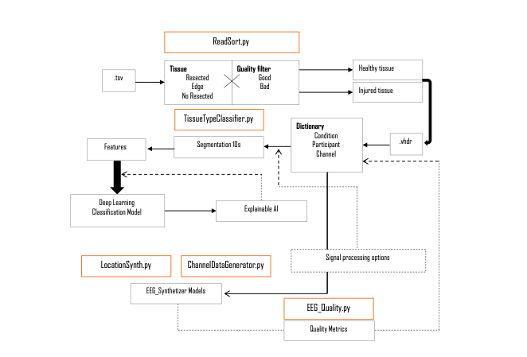
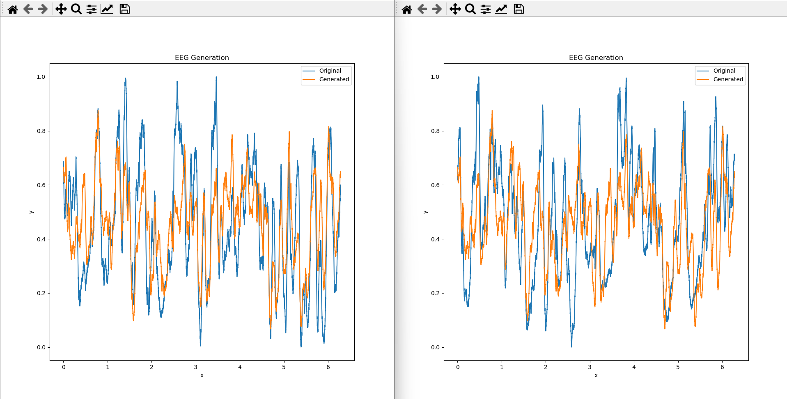

# Welcome to iEEG_Synthetizer 

iEEG_Synthetizer is a pivotal component of the AISym4Med Project. 
Our mission with the AISym4Med initiative is to revolutionize the field of medical data handling, specifically focusing 
on the generation of synthetic data for both clinical and research purposes.

There are key principles: ensuring privacy, enhancing transparency, fostering algorithmic robustness, and upholding the 
authenticity of data. The iEEG_Synthetizer plays a critical role in this vision. It is specially designed for the 
generation of synthetic intraoperative EEG data from participants who have epilepsy.

This technology stands as a testament to our dedication to advancing medical research and clinical care, while 
simultaneously safeguarding patient confidentiality and data integrity. Through the iEEG_Synthetizer, we aim to provide 
researchers and clinicians with robust, authentic datasets that can be used to drive innovations in epilepsy treatment 
and care, without compromising on the ethical aspects of data usage.

This is an ongoing project, and in this repo we share some amazing early demos of what we are currently developing. To create these models, it is possible to use data from the following dataset: https://openneuro.org/datasets/ds003844/versions/1.0.1

